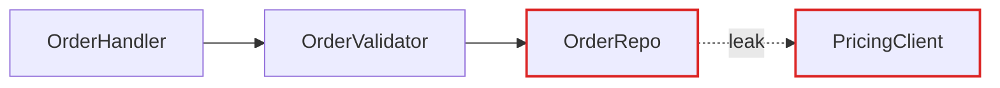
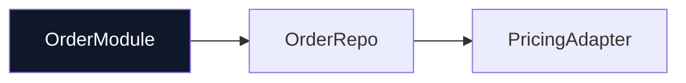

# Markdown Report Format

The architectural review as a Markdown file. Mermaid code blocks for diagrams — GitHub renders them natively, so the report works in issues, PRs, and terminals with Mermaid preview.

## Template

````markdown
# Architecture Review — {{repo}}

{{date}}

---

## Candidates

### 1. {{Candidate title}}

> **Strength**: Strong | Worth exploring | Speculative
> **Category**: in-process | local-substitutable | ports & adapters | mock

**Files**: `path/to/module.nix`, `path/to/handler.nix`

**Problem**: one sentence. What hurts.

**Solution**: one sentence. What changes.

**Wins**:

- locality: bugs concentrate in one module
- leverage: one interface, N call sites
- interface shrinks; implementation absorbs the wrappers

**Before / After**:


````



> ⚠️ Contradicts decision 0007, but worth reopening because…

---

### 2. {{Candidate title}}

...

---

## Top Recommendation

**{{Candidate name}}**: one sentence on why. Anchor link: [→ Candidate 1](#1-candidate-title).

````

## Diagram patterns

### Mermaid flowchart (dependencies, call flow)

Use for "X calls Y calls Z." Sequence diagrams for "before: 6 round-trips; after: 1."

```mermaid
flowchart LR
  A[Handler] --> B[Validator]
  B --> C[Repo]
````

### Before / After side by side

Use fenced code blocks with labels, or inline both in one mermaid block:

```mermaid
flowchart TB
  subgraph before["Before"]
    A1[Handler] --> B1[Validator]
    B1 --> C1[Repo]
    C1 -.leak.-> D1[PricingClient]
  end
  subgraph after["After"]
    A2[OrderModule] --> B2[Repo]
    B2 --> C2[PricingAdapter]
  end
```

### Cross-section (layered shallowness)

Use horizontal rules or a list:

**Before**:

```
[Route] → [Parse] → [Validate] → [Transform] → [Persist] → [Respond]
```

**After**:

```
[OrderModule] → [Persist]
```

### Mass diagram (interface vs implementation)

```
Module: PricingAdapter
  Interface:  ██ (2 methods)
  Implementation:  ████████████████████ (400 lines)
```

Before: `Interface: ████████████` / `Implementation: ████████████████`
After: `Interface: ██` / `Implementation: ████████████████████`

## Style

- Glossary terms only (module, seam, depth, adapter, leverage, locality).
- Wins bullets ≤6 words each, named in glossary terms.
- Mermaid code blocks render on GitHub. Keep diagrams simple — no custom themes.
